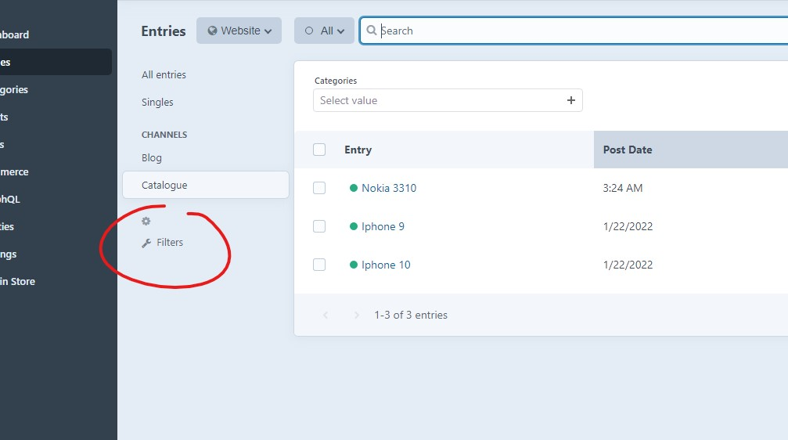

# Quick filters plugin for Craft CMS 3.x

Quick filters plugins allow you to easily create filter widgets for control panel lists like entries, categories, assets, users or commerce products and orders.

# Features

* Filters can be created using fields assigned to your content or attributes like entry post date. 
* Separate content groups like entry sections or category groups can have their filter widgets defined.
* You can filter by relation fields (like entry or category field), option fields (like checkboxes or radio groups) and lightwitch fields - using **dropdown widget**.
* Dropdown widget created from relation field is **populated using content** that is available for selection within this field. For example - with the category field, widget options will contain all categories that user can select using this field.
* In the case of multi-level categories or entry structures, **level layout** is represented in the dropdown widget, creating a "tree" structure. 
* You can filter by date using **date range widget** - consisting of two date pickers. This makes the selection of the period between two dates easy.
* You can filter by number field using the range widget which contains two numeric inputs. 
* You can filter by text or redactor fields using regular text input widget.
* Craft commerce support - you can filter products and order lists.

# How to add filter

* Open element list of your choosing - for example, entries list.
* Click the "Filters" link, right under "Customize" link, on the left of the list, the click "add new filter".
* Select type of filter - field or element attribute. Then select or attribute or field of your choosing.
* After adding multiple filters, you can also reorder them on the filters list.
* Keep in mind that separate content groups, for example, separate entry sections can have separate filters defined.

## Requirements

This plugin requires Craft CMS 3.0.0-beta.23 or later.

## Installation

To install the plugin, follow these instructions.

1. Open your terminal and go to your Craft project:

        cd /path/to/project

2. Then tell Composer to load the plugin:

        composer require craftsnippets/craft-quick-filters

3. In the Control Panel, go to Settings → Plugins and click the “Install” button for Quick filters.

Brought to you by [Piotr Pogorzelski](http://craftsnippets.com/)

Plugin logo created by [wikimedia](https://commons.wikimedia.org/wiki/File:Eo_circle_blue_white_letter-f.svg)