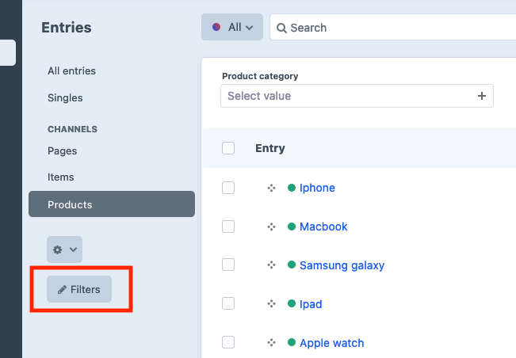

# Quick filters plugin for Craft CMS 5.x

Quick filters plugin allows you to easily create filter widgets for control panel element index lists for entries, categories, assets, users or commerce products and orders.

Please note that for Craft 5.x, it requires at least 5.3 Craft CMS version.

# Features

* Filters can be created using fields assigned to your content or attributes like entry post date. 
* Separate content groups like entry sections or category groups can have their filter widgets defined.
* You can filter by relation fields (like entry or category field), option fields (like checkboxes or radio groups) and lightwitch fields - using **dropdown widget**.
* Dropdown widget created from relation field is **populated using content** that is available for selection within this field. For example - with the category field, widget options will contain all categories that user can select using this field.
* In the case of multi-level categories or entry structures, **level layout** is represented in the dropdown widget, creating a "tree" structure. 
* You can filter by date using **date range widget** - consisting of two date pickers. This makes the selection of the period between two dates easy.
* You can filter by number field using the range widget which contains two numeric inputs. 
* You can filter by text or redactor fields using regular text input widget.
* Craft commerce support - you can filter products and order lists.
* Preparse field plugin support - you can filter by values generated by this plugin
* Colour swatches plugin support - dropdown widget created from such field will display squares filled with colors set for field options, along with options labels

# Quick filters plugin vs built-in filtering

Since Craft CMS 4, users can filter element index lists. However, filtering functionality provided by Quick Filters plugin has many advantages over built-in filtering functionality. 

* Quick filters plugin widgets are constantly displayed above element index lists, allowing for quick access and letting users keep track of entered values. With built-in filtering, users need to open filtering popup to change filter values or just check how list is filtered.
* Quick filters plugin lets users define separate filtering layouts for each of the element lists (like entry sections). Only filters selected by users will appear above element index list. With built-in filtering, each time users want to use filters, they need to open filtering popup and scroll through all possible filters to find the one they need.
* Quick filters plugin displays relation type filters (like one created from category fields) using dropdown widgets which visually show multi-level categories or entries hierarchy. With built-in filtering, users need to open element selection popup and search for element to filter by. This require much more clicks to achieve the same functionality.
* Quick filters plugin has Colour swatches plugin support, while built-in filtering does not.

# How to add filter

* Open element index list of your choosing - for example, entries list.
* Click the "Filters" link, right under "Customize" link, on the left of the list, then click "New filter".
* Select filter type - field or element attribute. Then select the attribute or field of your choosing.
* After adding multiple filters, you can also reorder them on the filters list.
* Keep in mind that separate content groups, for example, separate entry sections can have separate filter layouts.

## Requirements

This plugin requires Craft CMS 5.3 or later.

## Installation

To install the plugin, follow these instructions.

1. Open your terminal and go to your Craft project:

        cd /path/to/project

2. Then tell Composer to load the plugin:

        composer require craftsnippets/craft-quick-filters

3. In the Control Panel, go to Settings → Plugins and click the “Install” button for Quick filters.

Brought to you by [Piotr Pogorzelski](http://craftsnippets.com/)

Plugin logo - [Free Filter Icon | Line Icon](https://iconscout.com/free-icon/filter-3524156) by [Abyhades Design](https://iconscout.com/contributors/abyhadesign)
